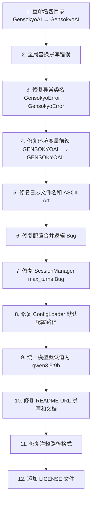

# GensokyoAI 项目问题修复计划

## 问题总览

经过全面排查，项目存在以下类别的问题：

1. **核心拼写错误** — `GensokyoAI` 应为 `GensokyoAI`（o 和 y 位置反了）
2. **逻辑 Bug** — 配置合并和会话管理中存在逻辑错误
3. **不一致问题** — 模型默认值、配置路径等多处不一致
4. **文档/注释问题** — README 链接错误、注释路径格式等

---

## 🔴 严重问题（影响功能正确性）

### 1. 配置合并逻辑 Bug — `stream` 和 `log_console` 逻辑反转

**文件**: `GensokyoAI/core/config.py`

**问题**: `_merge` 和 `_merge_model` 方法中，`stream` 和 `log_console` 的合并逻辑是反的：

```python
# 当前代码（错误）:
result.log_console = (
    override.log_console if not override.log_console else base.log_console
)
# 如果 override.log_console = True → 返回 base.log_console（忽略了用户的 True 设置！）
# 如果 override.log_console = False → 返回 override.log_console = False（反而生效了）

# 当前代码（错误）:
stream=override.stream if not override.stream else base.stream,
# 同样的问题：用户设置 stream=True 时反而被 base 覆盖
```

**修复**: 应改为直接使用 override 的值，或使用正确的 fallback 逻辑：

```python
# 修复方案:
result.log_console = override.log_console if override.log_console is not None else base.log_console
stream=override.stream,  # 直接使用 override 值
```

> 注意：整个 `_merge` 系列方法的逻辑都有类似问题，用"与默认值比较"来判断是否被用户设置过是不可靠的。建议重构为更健壮的合并策略。

### 2. SessionManager 中 `max_turns` 使用了错误的配置值

**文件**: `GensokyoAI/session/manager.py`

**问题**: `WorkingMemoryManager` 的 `max_turns` 参数使用了 `self.config.max_sessions`（会话最大数量，值为 100），而不是 `memory_config.working_max_turns`（工作记忆最大轮数，值为 20）：

```python
# 当前代码（错误）:
wm = WorkingMemoryManager(max_turns=self.config.max_sessions)  # 100 是会话数量，不是记忆轮数！
```

**修复**: 需要传入 `MemoryConfig.working_max_turns`，但 `SessionManager` 当前只接收 `SessionConfig`，需要同时接收 `MemoryConfig` 或修改初始化参数。

### 3. ConfigLoader 默认配置文件路径错误

**文件**: `GensokyoAI/core/config.py` 第 129 行

**问题**: 代码在包内部查找 `default.yaml`：

```python
default_file = Path(__file__).parent / "default.yaml"
# 这会查找 GensokyoAI/core/default.yaml，但该文件不存在！
```

实际默认配置文件位于 `config/default.yaml`（项目根目录下），不在包内部。

**修复**: 将 `config/default.yaml` 复制到 `GensokyoAI/core/default.yaml`，或修改路径逻辑使其指向正确位置。

---

## 🟠 中等问题（命名/拼写错误）

### 4. 包目录名拼写错误：`GensokyoAI` → `GensokyoAI`

**影响范围**: 整个项目

这是最核心的拼写错误。`Gensokyo`（幻想乡）被错拼为 `Genskoyo`，o 和 y 的位置反了。

**需要修改的内容**:

| 类型 | 当前值 | 修正值 | 涉及文件 |
|------|--------|--------|----------|
| 目录名 | `GensokyoAI/` | `GensokyoAI/` | 文件系统重命名 |
| Python import | `from GensokyoAI...` | `from GensokyoAI...` | 所有 `.py` 文件 |
| 文件注释 | `# GensokyoAI\...` | `# GensokyoAI/...` | 所有 `.py` 文件 |
| docstring | `GensokyoAI - 幻想乡 AI...` | `GensokyoAI - 幻想乡 AI...` | `__init__.py` |
| README | `GensokyoAI` | `GensokyoAI` | `README.md` |
| 配置注释 | `GensokyoAI 默认配置` | `GensokyoAI 默认配置` | `config/default.yaml` |
| 角色模板 | `GensokyoAI 角色配置文件模板` | `GensokyoAI 角色配置文件模板` | `characters/example.yaml` |

### 5. 异常类名拼写错误：`GensokyoError` → `GensokyoError`

**影响文件**:
- `GensokyoAI/core/exceptions.py` — 类定义
- `GensokyoAI/core/events.py` — import 和使用
- `GensokyoAI/__init__.py` — 导出

### 6. 环境变量前缀拼写错误：`GENSOKYOAI_` → `GENSOKYOAI_`

**影响文件**:
- `GensokyoAI/core/config.py` 第 283-292 行
- `README.md` 第 255-259 行
- `GensokyoAI/__init__.py` 第 78-81 行

### 7. 日志文件名拼写错误：`GENSOKYOAI.log` → `gensokyoai.log`

**影响文件**:
- `config/default.yaml` 第 6 行

### 8. ASCII Art 拼写错误

**文件**: `GensokyoAI/backends/console.py` 第 20-27 行

当前 ASCII Art 拼出的是 `GENSKOYO`，应修正为 `GENSOKYO`。需要重新设计 ASCII Art 字体布局。

---

## 🟡 轻微问题（不一致/文档）

### 9. 模型默认值三处不一致

| 位置 | 当前默认值 | 修正值 |
|------|-----------|--------|
| `GensokyoAI/core/config.py` ModelConfig | `qwen3:14b` | `qwen3.5:9b` |
| `config/default.yaml` | `qwen3.5:9b` | ✅ 已正确 |
| `README.md` 环境变量表 | `qwen2.5:7b` | `qwen3.5:9b` |

**修复**: 以 `default.yaml` 中的 `qwen3.5:9b` 为准（实际使用的版本），更新 `config.py` 的默认值和 README 环境变量表。

### 10. README 中 GitHub 仓库 URL 拼写错误

**文件**: `README.md`

- 第 9 行: `https://github.com/yourname/GensokyoAI` → `https://github.com/Patchouli-CN/GensokyoAI`
- 第 68 行: `https://github.com/Patchouli-CN/GensokyoAI.git` — Patchouli-CN 是正确的，只需修正 `GensokyoAI` → `GensokyoAI`
- 第 291 行: Star History 链接中的 `yourname/GensokyoAI` → `Patchouli-CN/GensokyoAI`

> 注意：Patchouli-CN 是项目原作者，JO-Beacon 是协助修改的协作者，URL 中保留 Patchouli-CN 是正确的。

### 11. 文件注释中使用 Windows 反斜杠路径

所有 `.py` 文件的注释行使用 `\` 而非 `/`：

```python
# 当前: # GensokyoAI\core\exceptions.py
# 应为: # GensokyoAI/core/exceptions.py
```

**影响文件**: 几乎所有 `GensokyoAI/` 下的 `.py` 文件（约 25+ 个文件）

### 12. `characters/example.yaml` 项目名引用

第 2 行: `GensokyoAI 角色配置文件模板` → `GensokyoAI 角色配置文件模板`

### 13. 缺少 LICENSE 文件

README 中提到 `MIT License - 详见 LICENSE 文件`，但项目根目录下没有 `LICENSE` 文件。

---

## 修复优先级和执行顺序



### 关键注意事项

1. **包目录重命名是破坏性变更** — 所有 Python import 都需要同步修改，建议一次性完成
2. **配置合并逻辑** — 当前的"与默认值比较"策略整体有缺陷，但最小修复是修正 `stream` 和 `log_console` 的反转逻辑
3. **SessionManager 的 max_turns Bug** — 需要修改 `SessionManager.__init__` 的参数签名，加入 `MemoryConfig` 或 `working_max_turns` 参数
4. **ASCII Art** — 需要重新设计，因为 `GENSOKYO` 和 `GENSKOYO` 字母顺序不同，不能简单替换
5. **模型默认值** — 统一为 `qwen3.5:9b`（实际使用的版本）
6. **README URL** — 保留 Patchouli-CN 作为仓库所有者，只修正拼写错误